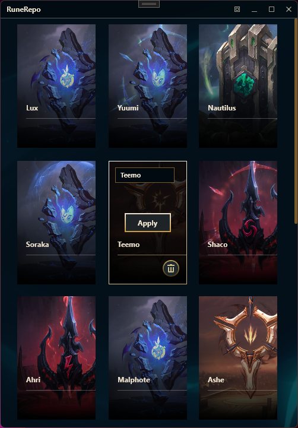
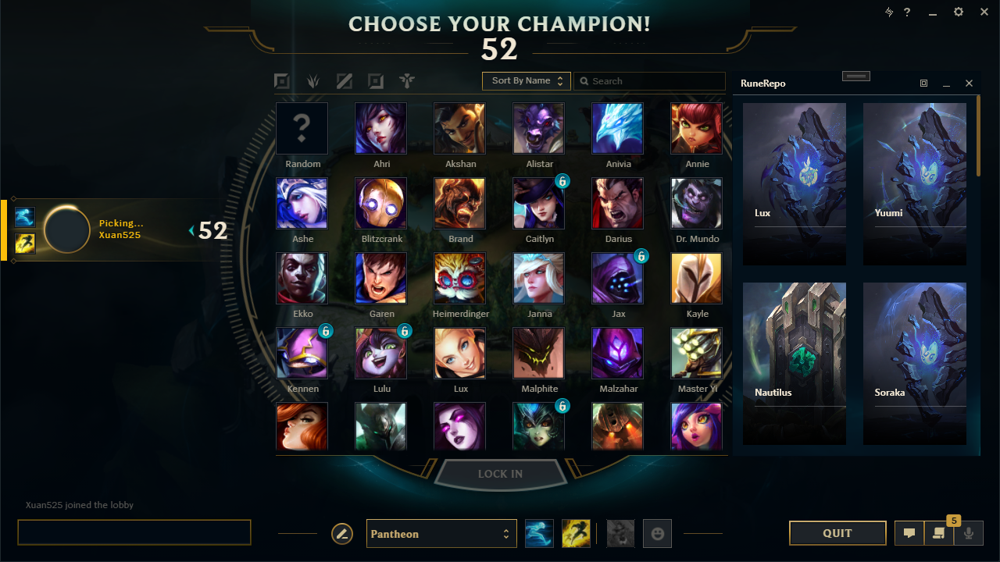

# RuneRepo

A tool on local machine for storing & appling League's Rune Pages

## Features

- Allows for Standalone mode or integrated into League's client
- Auto popup and hiding depending on game phases

## Preview

### Standalone

### Integrated

## Notes

- Button  on the tool's title bar to switch between standalone and integrated mode
- Button  on client's title bar to show tool window when the tool is integrated